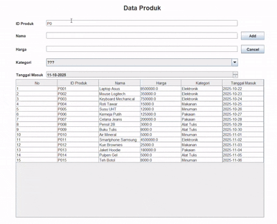

# TP5DPBO2425C1
TP 5 DPBO Java Swing GUI - Database dan Back-End

# Janji
Saya Muhammad Rangga Nur Praditha dengan Nim 2400297 mengerjakan Tugas Praktikum 5 dalam mata kuliah Desain Pemrograman Berorientasi Objek untuk keberkahan-Nya maka saya tidak akan melakukan kecurangan seperti yang telah di spesifikasikan

# Desain Program
Program ini merupakan sebuah CRUD untuk data produk dengan bahasa Java yang menggunakan library Swing untuk GUI. Terdapat 3 class dari program ini, yaitu:
1. Class Product
Class ini berisi data produk, dengan atribut yang sudah tersedia diantaranya:
- String id  
- String nama  
- Double harga  
- String kategori  
- Date tanggal masuk  
Untuk method yang ada diantaranya Setter dan Getter dari setiap atribut.
3. Class Product Menu
Class ini berisi GUI (Graphical User Interface) dari program, yang berfungsi untuk mengatur GUI serta method untuk Insert, Update dan Delete.
4. Database
Class yang berisi data dari produk dengan koneksi dan aturan Java ke MySQL. Dan ada method untuk menjalankan query select, dan InsertUpdateDeletequery.
5. Desain GUI

Dengan desain yang sama seperti pada TP 4 tetapi bedanya disini menggunakan tambahan JDBC (Java Database Connectivity) yang berfungsi untuk menghubungkan ke database agar datanya dapat diakses dan di dikelola menggunakan program Java.

# Alur Program
Program ini memiliki beberapa fungsi CRUD diantaranya:
1. Menampilkan Data (Read)
Menampikan Data terdapat pada tampilan utama yang berisi form data produk dan list data produk diantaranya:
- Id Produk  
- Nama Produk  
- Harga Produk  
- Kategori Produk  
- Tanggal Masuk Produk  
Serta button action Add, Update / Delete, dan Cancel disamping form, dan list tabel data produk yang sudah ada dibawah form.
2. Menambahkan Data (Create)
User dapat menambahkan data produk dengan mengisi form yang ada pada tampilan utama dan ketika sudah terisi menekan tombol Add dan Cancel jika tidak jadi mengisi. Serta ada beberapa syarat untuk menambahkan data yaitu:
- Untuk id di cek terlebih dahulu apakah ada yang sama atau tidak, jika id sudah dipakai maka tidak dapat di pakai lagi.  
- Serta jika masih ada form yang kosong maka tidak akan bisa di tambahkan sampai form terisi semua.
3. Mengedit Data (Update)
User dapat mengedit data produk yang sudah ada dengan memilih terlebih dahulu data yang ingin di edit pada tabel, lalu akan muncul isi data pada form dan edit form yang ingin di ganti, ketika sudah tekan tombol Update untuk edit data atau Cancel untuk membatalkan edit data. Serta ada beberapa syarat untuk menambahkan data yaitu:
Sama seperti Add pada Update juga ada
- Untuk id di cek terlebih dahulu apakah ada yang sama atau tidak jika ingin mengganti id nya, tetapi dia tidak akan mengecek id yang sedang dia gunakan, jika memilih id yang sudah dipakai maka tidak dapat di pakai lagi.  
- Serta jika masih ada form yang kosong maka tidak akan bisa di tambahkan sampai form terisi semua.
4. Hapus Data (Delete)
User dapat menghapus data produk yang sudah ada dengan memilih terlebih dahulu data yang ingin di hapus pada tabel, lalu tekan tombol Delete untuk menghapus data atau Cancel untuk membatalkan hapus data. Dan ada checking untuk apakah sudah yakin untuk menghapus data tersebut sehingga jika belum yakin bisa di Cancel untuk menghapus datanya.

# Dokumentasi

